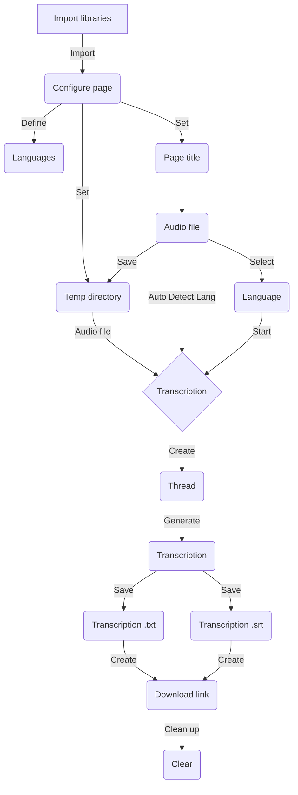

# Introduction

This is a simple GUI for OpenAI's Whisper model that allows users to transcribe audio files. The app is built using Streamlit and Whisper. You may access public webapp [here](https://simple-transcriber.streamlit.app/)

## Features

- Transcribe audio files using OpenAI's Whisper model
- Supports multiple languages
- Generates transcription in both .txt and .srt formats
- Provides a download link for the transcriptions

## Overview

## Requirements

To run this app, you will need to install the following packages:

- Streamlit
- Whisper

## Running the App

To run the app, clone this repository and navigate to the directory in your terminal. Then, enter the following command:

`streamlit run app.py`

This will open the app in your browser.

## Docker

You can also run the app using Docker. Build the Docker image using the provided Dockerfile:

`docker build -t simple-transcriber .`

Then, run the Docker image:

`docker run -p 8501:8501 simple-transcriber`

The app will be accessible at http://localhost:8501.

## Using the App

1. To begin transcribing an audio file, click the "Upload" button and select an audio file from your computer. Currently, the app supports the following audio file formats: mp3, wav, and m4a.
2. Once you have selected an audio file, press the "Transcribe" button to begin the transcription process.
3. The transcription will be displayed in the main area of the app.
4. You can download the transcription as a text file by clicking the "Download transcription" button.
5. You can also play the original audio file by clicking the "Play" button in the sidebar.

## Contributing
Contributions are welcome! Please read the contributing guidelines before getting started.

## License
This project is licensed under the terms of the MIT license. See the LICENSE file for details.